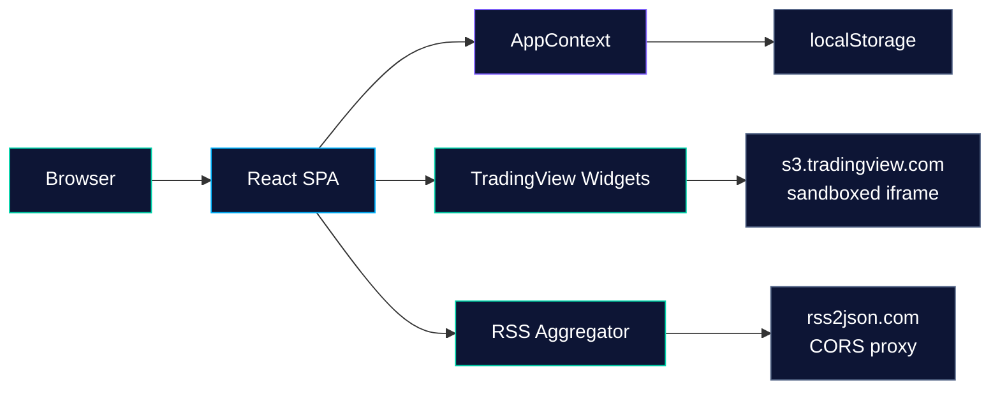

<div align="center">


<br/>
<br/>

[](https://react.dev)
[](https://typescriptlang.org)
[](https://vitejs.dev)
[](https://tailwindcss.com)
[](LICENSE)

**Real-time financial dashboard aggregating market indices, sectors, movers, forex, crypto & news into one glass-morphism UI**

[Live Demo](#) · [Report Bug](../../issues) · [Request Feature](../../issues)

</div>

---

<br/>

## Overview

Market Pulse is a production-grade financial dashboard built with React 18 and TypeScript. It pulls live market data through TradingView embedded widgets and aggregates financial news from four major RSS sources with intelligent deduplication. Everything runs client-side with zero backend requirements.

<br/>

## Features

<table>
<tr>
<td width="50%">

**Market Data**
- Live indices — S&P 500, Nasdaq, Dow, Russell, VIX
- Sector heatmap — S&P 500 with interactive filters
- Top movers — Pre-market, regular, after-hours
- Forex — Major & cross currency pairs
- Crypto — Top 8 by market cap
- Economic & Earnings calendars

</td>
<td width="50%">

**User Experience**
- Dark / Light theme with glassmorphism UI
- Personal watchlist with TradingView links
- Notes scratchpad (persisted)
- Saved views — snapshot & restore configs
- Compact mode for dense display
- Global search across headlines & watchlist
- Responsive — desktop, tablet, mobile

</td>
</tr>
</table>

<br/>

## Architecture



<br/>

## Tech Stack

| Layer | Technology | Purpose |
|:------|:-----------|:--------|
| **Framework** | React 18.3 + TypeScript 5.8 | Component architecture & type safety |
| **Build** | Vite 5.4 + SWC | Sub-second HMR & optimized bundles |
| **Styling** | Tailwind CSS 3.4 + CSS Variables | Utility-first with custom glassmorphism theme |
| **Components** | shadcn/ui (Radix primitives) | Accessible, unstyled component library |
| **State** | React Context + localStorage | Global state with client persistence |
| **Data** | TradingView Embeds + rss2json | Live market widgets & news aggregation |
| **Routing** | React Router DOM 6.30 | Client-side navigation |
| **Charts** | Recharts 2.15 | Available for custom visualizations |
| **Testing** | Vitest 3.2 + Playwright 1.59 | Unit & E2E testing |

<br/>

## Project Structure

```
market-pulse/
├── public/
│   ├── banner.svg             # Animated README banner
│   └── robots.txt             # SEO crawler rules
├── src/
│   ├── components/
│   │   ├── ui/                # 40+ shadcn/ui primitives
│   │   ├── Header.tsx         # Top nav + mobile tab bar
│   │   ├── MarketOverview.tsx # Main indices widget
│   │   ├── SectorHeatmap.tsx  # S&P 500 sector heatmap
│   │   ├── Movers.tsx         # Top gainers / losers
│   │   ├── Calendars.tsx      # Economic + earnings calendars
│   │   ├── NewsFeed.tsx       # RSS aggregator with dedup
│   │   ├── CurrencyConverter.tsx  # Forex pairs
│   │   ├── CryptoOverview.tsx # Crypto market quotes
│   │   ├── SidebarPanels.tsx  # Watchlist + Notes + Links
│   │   └── TradingViewWidget.tsx  # Secure TV widget loader
│   ├── context/
│   │   └── AppContext.tsx      # Global state management
│   ├── hooks/                 # Custom React hooks
│   ├── lib/utils.ts           # Tailwind merge utility
│   ├── pages/
│   │   ├── Index.tsx           # Dashboard layout
│   │   └── NotFound.tsx        # 404 page
│   ├── index.css              # Theme variables + glassmorphism
│   ├── App.tsx                # Router + providers
│   └── main.tsx               # Entry point
├── tailwind.config.ts         # Extended theme
├── vite.config.ts             # Build config
└── vitest.config.ts           # Test runner
```

<br/>

## Quick Start

```bash
# Clone
git clone https://github.com/<your-username>/market-pulse.git
cd market-pulse

# Install
npm install

# Dev server → http://localhost:8080
npm run dev

# Production build
npm run build
npm run preview
```

<br/>

## How It Works

### TradingView Widgets

The `TradingViewWidget` component loads market data widgets from TradingView's embed service. Each widget type (market-overview, stock-heatmap, hotlists, market-quotes, events) receives a JSON config and renders inside a managed container. Widget lifecycle is tied to React's effect cleanup cycle.

### News Aggregation

`NewsFeed` fetches headlines from four financial RSS sources (Yahoo Finance, CNBC, MarketWatch, Reuters) via the rss2json CORS proxy. Results are sorted chronologically and deduplicated using a word-overlap similarity algorithm with a 0.6 threshold. Failed feeds are reported individually without blocking the UI.

### State Persistence

`AppContext` manages theme, watchlist, notes, saved views, and UI preferences. All user data persists to `localStorage` under a single key and restores on mount with safe fallback defaults.

<br/>

## Security

### Implemented Protections

| Protection | Status | Details |
|:-----------|:------:|:--------|
| Content Security Policy | ✅ | CSP meta tag restricting script sources |
| Iframe Sandboxing | ✅ | `sandbox` attribute on all embedded iframes |
| URL Encoding | ✅ | `encodeURIComponent` on user-input URLs |
| External Link Safety | ✅ | `rel="noopener noreferrer"` on all external links |
| React DOM Management | ✅ | No direct DOM manipulation — all state-driven |
| No Secrets in Codebase | ✅ | Zero API keys, tokens, or credentials |
| Input Sanitization | ✅ | Watchlist symbols sanitized before use |

### Third-Party Dependencies

The app relies on two external services, both accessed client-side:

- **TradingView** (`s3.tradingview.com`) — Market data widgets. Trusted financial data provider.
- **rss2json** (`api.rss2json.com`) — RSS CORS proxy. Free tier with rate limits.

Neither requires API keys. For production hardening, consider deploying a self-hosted RSS proxy.

<br/>

## Deployment

### Netlify

```bash
npm run build
# Deploy dist/ folder
# Add _redirects: /*    /index.html   200
```

### Vercel

```json
{
  "rewrites": [{ "source": "/(.*)", "destination": "/index.html" }]
}
```

### GitHub Pages

```bash
npm run build
# Deploy dist/ to gh-pages branch
# Set base in vite.config.ts if using subpath
```

<br/>

## Limitations

- **No backend** — All data is client-side; no database, auth, or server
- **TradingView dependency** — Widget URLs are controlled by TradingView
- **rss2json rate limits** — Free tier may throttle heavy usage
- **No real-time streaming** — Data refreshes on widget re-render, not via WebSocket
- **No historical data** — Date picker is for saved views, not historical snapshots
- **Browser-only storage** — Clearing localStorage loses all user data

<br/>

## Roadmap

- [ ] Supabase backend for cloud-synced watchlists & notes
- [ ] WebSocket real-time price streaming
- [ ] Price alerts & push notifications
- [ ] Self-hosted RSS proxy (remove rss2json dependency)
- [ ] PWA with service worker offline support
- [ ] Portfolio tracker with P&L calculations
- [ ] Keyboard shortcuts for power users
- [ ] Historical data view tied to date picker
- [ ] Comprehensive test suite

<br/>

## Contributing

1. Fork the repository
2. Create your branch (`git checkout -b feature/amazing-feature`)
3. Commit changes (`git commit -m 'Add amazing feature'`)
4. Push to branch (`git push origin feature/amazing-feature`)
5. Open a Pull Request

<br/>

## License

Distributed under the MIT License. See `LICENSE` for more information.

<br/>

## Credits

| Resource | Usage |
|:---------|:------|
| [TradingView](https://www.tradingview.com/) | Market data widgets |
| [rss2json](https://rss2json.com/) | RSS feed proxy |
| [shadcn/ui](https://ui.shadcn.com/) | UI component library |
| [Lucide](https://lucide.dev/) | Icon set |
| [Radix UI](https://www.radix-ui.com/) | Accessible primitives |

<br/>

<div align="center">

---

**Built with precision by [Hassan Salman](https://github.com/3h0ll7)**

<sub>If you find this useful, consider giving it a star</sub>

</div>
